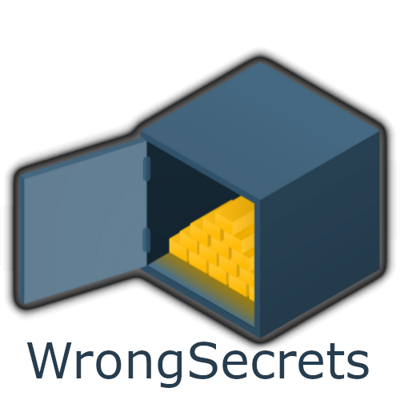

{ align=right width=180 }

### 7.8 WrongSecrets

OWASP [WrongSecrets][wrongsecrets-project] is a production status project
and provides challenges focused on secrets management using an intentionally vulnerable application and environment.
The project offers standalone and Capture-the-flag modes, with a demo on [Heroku][wsheroku].

#### What is WrongSecrets?

[WrongSecrets][wrongsecrets] goals are to:

* Educate on secret management and its pitfalls
* Help people reflect on their secrets management strategy
* Promote secrets management as an important facet of security

The project provides challenges around secrets management across several layers:

* A Spring Boot Java application
* Application configuration
* Docker
* Kubernetes
* Vault
* AWS, GCP, or Azure
* Binaries / Reverse engineering

Scenarios vary in difficulty, and you can solve some of them just by using the browser on your mobile phone.
For others, you would need knowledge of [cloud security][cscloud] or reverse engineering tools and cryptography.

#### Why use it?

If you, your team or your organization want to learn about secrets management and potential pitfalls,
you can do so with WrongSecrets' challenges.

Alternatively you can use WrongSecrets as a testbed/benchmark for testing secret detector tools;
the tool _should_ be able to detect the secrets wrongly managed in the WrongSecrets applications.

#### How to use it

The demo is available on [Heroku][wsheroku].

You can set WrongSecrets up in standalone or in capture the flag (CTF) mode on Docker, Kubernetes, AWS, GCP or Azure.

Set-up guides for the standalone version are available in the [project README][readme].

For the setting up a CTF project, WrongSecrets provides the [set-up guides][ctf]
and an example [Helm chart][wrongsecrets-helm].

#### References

* OWASP [WrongSecrets][wrongsecrets-project]
* [Secure Cloud Architecture][cscloud] cheat sheet
* [WrongSecrets demo][wsheroku]

---

The OWASP Developer Guide is a community effort; if there is something that needs changing
then [submit an issue][issue0908] or [edit on GitHub][edit0908].

[cscloud]: https://cheatsheetseries.owasp.org/cheatsheets/Secure_Cloud_Architecture_Cheat_Sheet
[ctf]: https://github.com/OWASP/wrongsecrets/blob/master/ctf-instructions.md
[edit0908]: https://github.com/OWASP/DevGuide/blob/main/docs/07-training-education/08-wrongsecrets.md
[wsheroku]: https://wrongsecrets.herokuapp.com/
[issue0908]: https://github.com/OWASP/DevGuide/issues/new?labels=content&template=request.md&title=Update:%2007-training-education/08-wrongsecrets
[readme]: https://github.com/OWASP/wrongsecrets/blob/master/README.md
[wrongsecrets]: https://github.com/OWASP/wrongsecrets
[wrongsecrets-helm]: https://owasp.org/wrongsecrets-ctf-party/
[wrongsecrets-project]: https://owasp.org/www-project-wrongsecrets/
