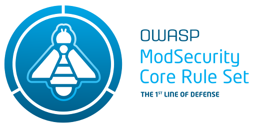

{: style="height:180px;float:right" }

### 9.4 OWASP CRS

The [OWASP CRS][crs-project] project, formerly known as Core Rule Set, is a set of generic attack detection rules
for use with [ModSecurity][modsec] compatible web application firewalls such as [OWASP Coraza][coraza].
CRS is an OWASP [Flagship tool project][crs-project] and can be [downloaded][crs-download]
for either Apache or IIS/Nginx web servers.

#### What is the CRS?

The [CRS][crs] are attack detection rules for use with [ModSecurity][modsec],
[Coraza][coraza] and other ModSecurity compatible web application firewalls.
The CRS aims to protect web applications from a wide range of attacks with a minimum of false alerts.
The CRS provides protection against many common attack categories, including those in the OWASP Top Ten.

#### Why use it?

If an organization is using a Coraza, ModSecurity or compatible Web Application Firewall (WAF)
then it is very likely that the [CRS][crs] is already in use by this WAF.
The CRS provides the policy for the Coraza / Modsecurity engine so that traffic to a web application is inspected
for various attacks and malicious traffic is blocked.

#### How to use it

The use of the CRS assumes that a ModSecurity, Coraza or compatible WAF has been installed.
Refer to the [Coraza tutorial][coraza-tutorial] or the [ModSecurity][modsec-docs] on how to do this.

To get started with CRS refer to the CRS [installation instructions][crs-download].

The OWASP Spotlight series provides an overview of how to use this CRS:
'Project 3 - [Core Rule Set (CRS) - 1st Line of Defense][spotlight03]'.

#### References

* OWASP [CRS][crs]
* OWASP [ModSecurity][modsec]
* OWASP [Coraza][coraza]

----

The OWASP Developer Guide is a community effort; if there is something that needs changing
then [submit an issue][issue1104] or [edit on GitHub][edit1104].

[coraza]: https://coraza.io/
[coraza-tutorial]: https://coraza.io/docs/tutorials/quick-start/
[edit1104]: https://github.com/OWASP/www-project-developer-guide/blob/main/draft/11-operations/04-crs.md
[issue1104]: https://github.com/OWASP/DevGuide/issues/new?labels=content&template=request.md&title=Update:%2011-operations/04-crs
[crs]: https://coreruleset.org/
[crs-download]: https://coreruleset.org/docs/deployment/install/
[crs-project]: https://owasp.org/www-project-modsecurity-core-rule-set/
[modsec]: https://owasp.org/www-project-modsecurity/
[modsec-docs]: https://www.modsecurity.org/
[spotlight03]: https://youtu.be/88ZMKpiZbRI
