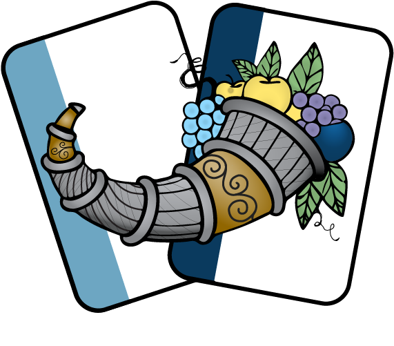

{ align=right width=180 }

#### What is Cornucopia?

OWASP Cornucopia is a mechanism in the form of a card game to assist software development teams in identifying security
requirements in Agile, conventional and formal development processes. It is language, platform and technology-agnostic.
The idea behind Cornucopia is to help development teams, especially those using Agile methodologies, identify application
security requirements and develop security-based user stories.
[Cornucopia][cornucopia] is an OWASP production project. The cards can be [downloaded][cornucopia-cards] and printed or
[bought online][online] from its website.
It is also possible to play OWASP Cornucopia online using the cornucopia game engine called [Copi][copi].
The game engine also has a broad selection of other EoP-related games.

#### Why use it?

The [OWASP Cornucopia][cornucopia] card game is designed to help developers think about possible threats in a solution
design, and derive a set of security requirements to build against. Team members are each dealt cards that describe
particular threats. They then take turns trying to make a case for their particular threat, posing a risk to the solution
design, scoring points if they are able to do so.

OWASP Cornucopia uses threats grouped into areas that are particularly relevant to software developers, such as AI,
authentication, authorisation, cloud, data validation & encoding, DevOps, and frontend (client-side development).
The threats are derived from various standards, OWASP Top 10 lists, guides,
and other lists. For a full list and to find out how you can acquire and
play their list of games, see their website at
[cornucopia.owasp.org][mapping].

Cornucopia is useful for both requirements analysis and threat modeling,
providing gamification of these activities within the development lifecycle.
It is targeted towards agile development teams and provides a different perspective on these tasks.

The outcome of the game is to identify possible threats and propose remediations.

#### How to use Cornucopia

Cornucopia can be played in many different ways; there is no one way,
and there is a suggested [set of rules][cornucopia-play] to start the game off.
[OWASP Threat Dragon][threat-dragon] also has a diagram called "EoP Games" that allows the players to link the card that
scores directly to a threat model to simplify security requirement analysis.

The OWASP Spotlight series provides an excellent overview of Cornucopia and how it can be used for gamification:
'Project 16 - [Cornucopia][spotlight16]'. [Videos on the OWASP Cornucopia website][cornucopia-play] also demonstrate several
ways the game can be utilized. There is also a [OWASP 25th Anniversary Video][owasp25th] that gives a short presentation on
the games and how to use them.

#### References

* [OWASP Cornucopia Website][cornucopia]
* [Spotlight][spotlight16] on Cornucopia

----

The OWASP Developer Guide is a community effort; if there is something that needs changing
then [submit an issue][issue060104] or [edit on GitHub][edit060104].

[cornucopia]: https://cornucopia.owasp.org
[cornucopia-cards]: https://cornucopia.owasp.org/printing#Current-printable-version
[cornucopia-play]: https://cornucopia.owasp.org/how-to-play
[copi]: https://copi.owasp.org
[edit060104]: https://github.com/OWASP/DevGuide/blob/main/docs/en/04-design/01-threat-modeling/04-cornucopia.md
[issue060104]: https://github.com/OWASP/DevGuide/issues/new?labels=content&template=request.md&title=Update:%2004-design/01-threat-modeling/04-cornucopia
[mapping]: https://cornucopia.owasp.org/about#Mappings
[online]: https://cornucopia.owasp.org/webshop
[owasp25th]: https://www.youtube.com/watch?v=KmjUM0EF_24
[spotlight16]: https://youtu.be/NesxjEGX58s
[threat-dragon]: https://www.threatdragon.com
