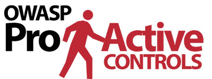

{ align=right width=140 }

The OWASP [Top 10 Proactive Controls][proactive10] describes the most important controls and control categories
that security architects and development teams should consider in web application projects.

#### What are the Top 10 Proactive Controls?

The OWASP Top 10 Proactive Controls is a list of security techniques that should be considered for web applications.
They are ordered by order of importance, with control number 1 being the most important:

* C1: [Implement Access Control][control1], ref [Cheat Sheets][csproactive-c1]
* C2: [Use Cryptography the proper way][control2], ref [Cheat Sheets][csproactive-c2]
* C3: [Validate all Input & Handle Exceptions][control3], ref [Cheat Sheets][csproactive-c3]
* C4: [Address Security from the Start][control4], ref [Cheat Sheets][csproactive-c4]
* C5: [Secure By Default Configurations][control5], ref [Cheat Sheets][csproactive-c5]
* C6: [Keep your Components Secure][control6], ref [Cheat Sheets][csproactive-c6]
* C7: [Implement Digital Identity][control7], ref [Cheat Sheets][csproactive-c7]
* C8: [Leverage Browser Security Features][control8], ref [Cheat Sheets][csproactive-c8]
* C9: [Implement Security Logging and Monitoring][control9], ref [Cheat Sheets][csproactive-c9]
* C10: [Stop Server Side Request Forgery][control10], ref [Cheat Sheets][csproactive-c10]

#### Why use them?

The Proactive Controls are a well established list of security controls, first published in 2014
and revised in 2018, so considering these controls can be seen as best practice.
Following best practices is always encouraged: at the very least an organization should avoid the avoidable exploits.

Putting these proactive controls in place can help remediate common security vulnerabilities, for example:

* [Clickjacking][csclick]
* [Credential Stuffing][cscreds]
* [Cross-site leaks][csxsleaks]
* [Denial of Service][csdos] (DoS) attacks
* DOM based [XSS attacks][csdom] including [DOM Clobbering][csdomclub]
* [IDOR][csidor] (Insecure Direct Object Reference)
* [Injection][csinjection] including [OS Command injection][csosinjection] and [XXE][csxxe]
* LDAP specific [injection attacks][csldap]
* [Prototype pollution][csproto]
* [SSRF][csssrf] attacks
* [SQL injection][cssql] and the use of [Query Parameterization][csquery]
* [Unvalidated redirects and forwards][csredirect]
* [XSS attacks][csxss] and [XSS Filter Evasion][csxssevade]

#### How to apply them

The OWASP Spotlight series provides an overview of how to use this documentation project:
'Project 8 - [Proactive Controls][spotlight08]'.

During development of a web application, consider using each security control
described in the sections of the Proactive Controls that are relevant to the application.

The OWASP Cheat Sheets have been indexed specifically for [each Proactive Control][csproactive],
which can be used as additional information on implementing the control.

#### References

* OWASP [Proactive Controls project][proactive10]
* OWASP Cheat Sheet [Proactive Controls index][csproactive]

----

The OWASP Developer Guide is a community effort; if there is something that needs changing
then [submit an issue][issue070101] or [edit on GitHub][edit070101].

[csclick]: https://cheatsheetseries.owasp.org/cheatsheets/Clickjacking_Defense_Cheat_Sheet
[cscreds]: https://cheatsheetseries.owasp.org/cheatsheets/Credential_Stuffing_Prevention_Cheat_Sheet
[csdom]: https://cheatsheetseries.owasp.org/cheatsheets/DOM_based_XSS_Prevention_Cheat_Sheet
[csdomclub]: https://cheatsheetseries.owasp.org/cheatsheets/DOM_Clobbering_Prevention_Cheat_Sheet
[csdos]: https://cheatsheetseries.owasp.org/cheatsheets/Denial_of_Service_Cheat_Sheet
[csidor]: https://cheatsheetseries.owasp.org/cheatsheets/Insecure_Direct_Object_Reference_Prevention_Cheat_Sheet
[csinjection]: https://cheatsheetseries.owasp.org/cheatsheets/Injection_Prevention_Cheat_Sheet
[csosinjection]: https://cheatsheetseries.owasp.org/cheatsheets/OS_Command_Injection_Defense_Cheat_Sheet
[csldap]: https://cheatsheetseries.owasp.org/cheatsheets/LDAP_Injection_Prevention_Cheat_Sheet
[csproto]: https://cheatsheetseries.owasp.org/cheatsheets/Prototype_Pollution_Prevention_Cheat_Sheet
[csproactive]: https://cheatsheetseries.owasp.org/IndexProactiveControls
[csproactive-c1]: https://cheatsheetseries.owasp.org/IndexProactiveControls.html#c1-define-security-requirements
[csproactive-c2]: https://cheatsheetseries.owasp.org/IndexProactiveControls.html#c2-leverage-security-frameworks-and-libraries
[csproactive-c3]: https://cheatsheetseries.owasp.org/IndexProactiveControls.html#c3-secure-database-access
[csproactive-c4]: https://cheatsheetseries.owasp.org/IndexProactiveControls.html#c4-encode-and-escape-data
[csproactive-c5]: https://cheatsheetseries.owasp.org/IndexProactiveControls.html#c5-validate-all-inputs
[csproactive-c6]: https://cheatsheetseries.owasp.org/IndexProactiveControls.html#c6-implement-digital-identity
[csproactive-c7]: https://cheatsheetseries.owasp.org/IndexProactiveControls.html#c7-enforce-access-controls
[csproactive-c8]: https://cheatsheetseries.owasp.org/IndexProactiveControls.html#c8-protect-data-everywhere
[csproactive-c9]: https://cheatsheetseries.owasp.org/IndexProactiveControls.html#c9-implement-security-logging-and-monitoring
[csproactive-c10]: https://cheatsheetseries.owasp.org/IndexProactiveControls.html#c10-handle-all-errors-and-exceptions
[csredirect]: https://cheatsheetseries.owasp.org/cheatsheets/Unvalidated_Redirects_and_Forwards_Cheat_Sheet
[cssql]: https://cheatsheetseries.owasp.org/cheatsheets/SQL_Injection_Prevention_Cheat_Sheet
[csquery]: https://cheatsheetseries.owasp.org/cheatsheets/Query_Parameterization_Cheat_Sheet
[csssrf]:  https://cheatsheetseries.owasp.org/cheatsheets/Server_Side_Request_Forgery_Prevention_Cheat_Sheet
[csxss]: https://cheatsheetseries.owasp.org/cheatsheets/Cross_Site_Scripting_Prevention_Cheat_Sheet
[csxsleaks]: https://cheatsheetseries.owasp.org/cheatsheets/XS_Leaks_Cheat_Sheet
[csxssevade]: https://cheatsheetseries.owasp.org/cheatsheets/XSS_Filter_Evasion_Cheat_Sheet
[csxxe]: https://cheatsheetseries.owasp.org/cheatsheets/XML_External_Entity_Prevention_Cheat_Sheet
[control1]: https://top10proactive.owasp.org/the-top-10/c1-accesscontrol/
[control2]: https://top10proactive.owasp.org/the-top-10/c2-crypto/
[control3]: https://top10proactive.owasp.org/the-top-10/c3-validate-input-and-handle-exceptions/
[control4]: https://top10proactive.owasp.org/the-top-10/c4-secure-architecture/
[control5]: https://top10proactive.owasp.org/the-top-10/c5-secure-by-default/
[control6]: https://top10proactive.owasp.org/the-top-10/c6-use-secure-dependencies/
[control7]: https://top10proactive.owasp.org/the-top-10/c7-secure-digital-identities/
[control8]: https://top10proactive.owasp.org/the-top-10/c8-help-the-browser-defend-the-user/
[control9]: https://top10proactive.owasp.org/the-top-10/c9-security-logging-and-monitoring/
[control10]: https://top10proactive.owasp.org/the-top-10/c10-stop-server-side-request-forgery/
[edit070101]: https://github.com/OWASP/DevGuide/blob/main/docs/en/05-implementation/01-documentation/01-proactive-controls.md
[issue070101]: https://github.com/OWASP/DevGuide/issues/new?labels=content&template=request.md&title=Update:%2005-implementation/01-documentation/01-proactive-controls
[proactive10]: https://top10proactive.owasp.org/
[spotlight08]: https://youtu.be/HRtYDCWOSc0
