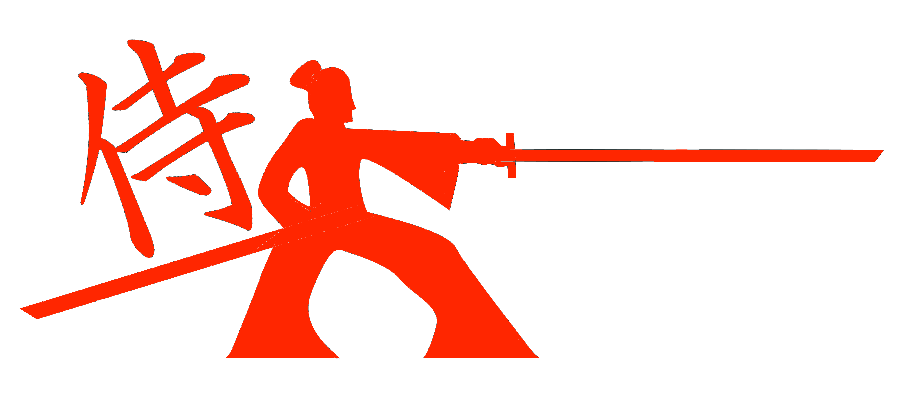
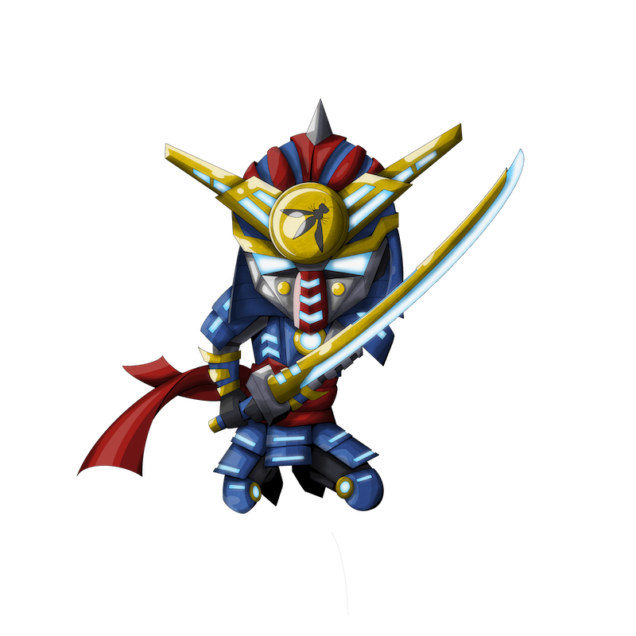

{ align=right width=250 }

The OWASP [SamuraiWTF][samurai-wtf] (Web Training and Testing Framework) is a linux desktop distribution
that is intended for application security training.

The SamuraiWTF [breaker/tool project][samuraiwtf-project] is an OWASP Laboratory Project
and the desktop can be downloaded as a pre-built virtual machine from the [website][samuraiwtf-download].

#### What is SamuraiWTF?

[Samurai Web Training Framework][samurai-wtf] is similar in spirit to the widely used [Kali Linux][kali] distribution;
it is a distribution of an Ubuntu desktop that integrates many open-source tools used for penetration testing.

SamuraiWTF is different to Kali in that it is meant as a training environment for attacking web applications
rather than as a more general and comprehensive pen-testers toolkit.
It was originally a web testing framework tool, but has been migrated to a training tool for penetration testing.
For this reason it integrates a different set of tools from Kali;
it focuses only on the tools used during a web penetration test.

[Samurai-Dojo][samurai-dojo] is a set of vulnerable web applications
that can be used to exercise the SamuraiWTF testing framework.
In addition there is the [Katana][samurai-katana] which provides configuration to install specific tools and targets.
This allows instructors to set up a classroom lab, for example, that can be distributed to their students.

#### Why use it?

{ align=right width=180 }

SamuraiWTF is easy to use and comes as a virtual machine, which makes it ideal in a teaching environment
or as an attack tool targeted specifically against web applications.
The teaching environment can be tailored for a particular set of lessons using the command line tool 'katana'.

The applications provided by Samurai-Dojo provides a set of real world applications to attack;
these applications are contained within the Samurai Web Training Framework virtual machine.
This provides a teaching environment where none of the attack traffic will leak from the environment,
and so avoids triggering network intrusion detection systems.

#### How to use it

The OWASP Spotlight series provides an overview of training provided by SamuraiWTF:
'Project 26 - [OWASP SamuraiWTF][spotlight26]'.

Getting started with SamuraiWTF is described in the [github README][samuraiwtf-download] :

* either download the virtual machine for Oracle VirtualBox
* or download the Hyper-V for Windows
* or build an Amazon Workspace

Run the Samurai Web Training Framework and login as the super-user 'samurai'.
From a command prompt run 'katana' to start configuring SamuraiWTF for your training purposes, for example 'katana list'.

#### References

* OWASP [SamuraiWTF][samuraiwtf] main site
* [SamuraiWTF Dojo][samurai-dojo]
* [SamuraiWTF Katana][samurai-katana]
* [SamuraiWTF downloads][samuraiwtf-download]
* SamuraiWTF [OWASP project][samuraiwtf-project]

----

The OWASP Developer Guide is a community effort; if there is something that needs changing
then [submit an issue][issue0904] or [edit on GitHub][edit0904].

[edit0904]: https://github.com/OWASP/DevGuide/blob/main/docs/07-training-education/04-samurai-wtf.md
[issue0904]: https://github.com/OWASP/DevGuide/issues/new?labels=content&template=request.md&title=Update:%2007-training-education/04-samurai-wtf
[kali]: https://www.kali.org/
[samuraiwtf]: https://www.samuraiwtf.org/
[samurai-dojo]: https://owasp.org/www-project-samuraiwtf/#div-dojo
[samurai-katana]: https://owasp.org/www-project-samuraiwtf/#div-katana
[samurai-wtf]: https://www.samurai-wtf.org/
[samuraiwtf-download]: https://github.com/SamuraiWTF/samuraiwtf/blob/main/README.md
[samuraiwtf-project]: https://owasp.org/www-project-samuraiwtf/
[spotlight26]: https://youtu.be/PBWUlx_kJmI
