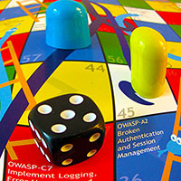

{ align=right width=180 }

OWASP [Snakes & Ladders][snakes] is an educational project based on the popular board game.
It uses gamification to promote awareness of application security controls and risks,
and in particular knowledge of other OWASP documents and tools.

This documentation project is an OWASP Lab project, aimed at security builders and defenders.

#### What is it?

Yes, it really is the snakes & ladders game, but for web and [mobile application security][csmas].
[It is played][snakeshowto] by two competing teams, possibly accompanied by beer and pretzels.

In the board game for web applications, the virtuous behaviors (ladders) are secure coding practices
(using the OWASP [Proactive Controls][proactive10]) and the vices (snakes)
are application security risks from the [OWASP Top Ten][top102017] 2017 version.

The web application version can be downloaded for various languages:

* [German](https://github.com/OWASP/www-project-snakes-and-ladders/tree/master/assets/files/web/DE) (DE)
* [English](https://github.com/OWASP/www-project-snakes-and-ladders/tree/master/assets/files/web/EN) (EN)
* [Spanish](https://github.com/OWASP/www-project-snakes-and-ladders/tree/master/assets/files/web/ES) (ES)
* [French](https://github.com/OWASP/www-project-snakes-and-ladders/tree/master/assets/files/web/FR) (FR)
* [Japanese](https://github.com/OWASP/www-project-snakes-and-ladders/tree/master/assets/files/web/JA) (JA)
* [Turkish](https://github.com/OWASP/www-project-snakes-and-ladders/tree/master/assets/files/web/TR) (TR)
* [Chinese](https://github.com/OWASP/www-project-snakes-and-ladders/tree/master/assets/files/web/ZH) (ZH)

The board game for mobile applications uses the mobile controls
detailed in the [OWASP Mobile Top 10][mobile10controls] as the virtuous behaviors.
The vices are the [Mobile Top 10 risks][mobile10-2014] from the 2014 version of the project.

The mobile application version is available as a download in
[English](https://github.com/OWASP/www-project-snakes-and-ladders/tree/master/assets/files/mob/EN)
and [Japanese](https://github.com/OWASP/www-project-snakes-and-ladders/tree/master/assets/files/mob/JA)

#### Why use it?

This board game was created so that it could be used as an ice-breaker in application security training.
It also has wider appeal as learning materials for developers or simply as a promotional hand-out.

To cover all of that, the Snakes & Ladders project team summarize it as:

"OWASP Snakes and Ladders is meant to be used by software programmers, big and small"

The game is quite lightweight; so it is meant to be just some fun with some learning attached,
and is not intended to have the same rigor or depth as the card game [Cornucopia][cornucopia].

When the project was first created there was a print run of the game on heavy duty paper.
These were available at conferences and meetings - they were also available to be purchased online
but this last option no longer seems to be available.  

#### References

* OWASP [Snakes & Ladders][snakes]
* OWASP [Proactive Controls][proactive10]
* OWASP [Top Ten][top102017] 2017 version
* OWASP [Mobile Top 10][mobile10controls]
* OWASP [Cornucopia][cornucopia].

----

The OWASP Developer Guide is a community effort; if there is something that needs changing
then [submit an issue][issue0909] or [edit on GitHub][edit0909].

[cornucopia]: https://owasp.org/www-project-cornucopia/
[csmas]: https://cheatsheetseries.owasp.org/cheatsheets/Mobile_Application_Security_Cheat_Sheet
[edit0909]: https://github.com/OWASP/DevGuide/blob/main/docs/en/07-training-education/09-snakes-ladders.md
[issue0909]: https://github.com/OWASP/DevGuide/issues/new?labels=content&template=request.md&title=Update:%2007-training-education/09-snakes-ladders
[mobile10-2014]: https://owasp.org/www-project-mobile-top-10/2014-risks/
[mobile10controls]: https://owasp.org/www-project-mobile-top-10/#div-controls
[proactive10]: https://owasp.org/www-project-proactive-controls/
[snakes]: https://owasp.org/www-project-snakes-and-ladders/
[snakeshowto]: https://owasp.org/www-project-snakes-and-ladders/#div-play
[top102017]: https://owasp.org/www-project-top-ten/2017/
