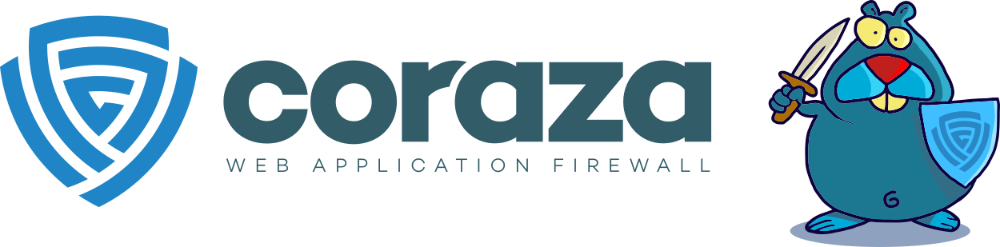

{ align=right width=300 }

The [OWASP Coraza][coraza-project] project provides a golang enterprise-grade Web Application Firewall framework
that supports the [ModSecurity][modsec] seclang language and is completely compatible with OWASP [Core Rule Set][crs] (CRS).
Coraza is in active development as an OWASP Production code project,
with the first stable version released in September 2021 and several releases since then.

#### What is Coraza?

The [Coraza][coraza] Web Application Firewall framework is used to enforce policies,
providing a first line of defense to stop attacks on web applications and servers.
Coraza  can be configured using the OWASP [CRS][crs] and also custom policies can be created.

Coraza can be deployed:

* as a library in an existing web server
* within an application server acting as a WAF
* as a reverse proxy
* using a docker container

#### Why use Coraza?

Web Application Firewalls are usually the first line of defense against HTTP attacks on web applications and servers.
The Coraza WAF is widely used for providing this security, especially for [cloud applications][cscloud],
along with the original OWASP [ModSecurity][modsec] WAF.

#### How to use Coraza

The best way to start is to create a Coraza WAF instance and then add rules to this WAF,
following the Coraza [Quick Start tutorial][coraza-tutorial].

There are multiple ways of running Coraza, the one chosen will depend on
the individual organization's deployment and existing infrastructure:

* Coraza [SPOA connector][coraza-spoa] runs the Coraza WAF as a backing service for HAProxy
* Coraza [Caddy Module][coraza-caddy] provides Web Application Firewall capabilities for Caddy
* the Coraza [Proxy WASM][coraza-wasm] filter can be loaded directly from Envoy or used as an Istio plugin
* Coraza as a [C library][coraza-lib], used for applications written in C/C++ rather than golang
* Coraza for [NGINX][nginx], Apache [APISIX][apisix], [Traefik][traefik] and [Envoy][envoy]

#### References

* OWASP [Coraza][coraza]
* Infrastructure specific Coraza [Connectors][connectors]
* OWASP [CRS][crs]
* OWASP [ModSecurity][modsec]
* [Secure Cloud Architecture][cscloud] cheat sheet

----

The OWASP Developer Guide is a community effort; if there is something that needs changing
then [submit an issue][issue1102] or [edit on GitHub][edit1102].

[apisix]: https://github.com/corazawaf/coraza-proxy-wasm
[connectors]: https://www.coraza.io/connectors/
[coraza]: https://www.coraza.io/
[coraza-caddy]: https://github.com/corazawaf/coraza-caddy
[coraza-lib]: https://github.com/corazawaf/libcoraza
[coraza-project]: https://owasp.org/www-project-coraza-web-application-firewall/
[coraza-spoa]: https://github.com/corazawaf/coraza-spoa
[coraza-tutorial]: https://www.coraza.io/docs/tutorials/quick-start/
[coraza-wasm]: https://github.com/corazawaf/coraza-proxy-wasm
[cscloud]: https://cheatsheetseries.owasp.org/cheatsheets/Secure_Cloud_Architecture_Cheat_Sheet
[edit1102]: https://github.com/OWASP/DevGuide/blob/main/docs/en/09-operations/02-coraza.md
[envoy]: https://github.com/united-security-providers/coraza-envoy-go-filter
[issue1102]: https://github.com/OWASP/DevGuide/issues/new?labels=content&template=request.md&title=Update:%2009-operations/02-coraza
[crs]: https://coreruleset.org/
[modsec]: https://owasp.org/www-project-modsecurity/
[nginx]: https://github.com/corazawaf/coraza-nginx
[traefik]: https://github.com/jcchavezs/coraza-http-wasm-traefik
