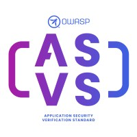

{ align=right width=180 }

El [Estándar de Verificación de Seguridad de Aplicaciones][asvs] (ASVS) es un proyecto insignia de OWASP
establecido desde hace tiempo,
y es ampliamente utilizado para sugerir requisitos de seguridad, así como
para la verificación central de aplicaciones web.

Se puede descargar desde la [página del proyecto OWASP][asvs] en varios idiomas y formatos:
PDF, Word, CSV, XML y JSON. Dicho esto, la forma recomendada de consumir el ASVS es acceder
directamente a las [páginas markdown de github][asvsmd] - esto asegurará que se utilice la versión más reciente.

#### ¿Qué es ASVS?

El ASVS es un estándar abierto que establece la cobertura y el nivel de rigor esperados cuando se trata de
realizar la verificación de seguridad de aplicaciones web.
El estándar también proporciona una base para probar cualquier control técnico de seguridad
en el que se confía para proteger contra vulnerabilidades en la aplicación.

El ASVS se divide en varias secciones:

* V1 [Arquitectura, Diseño y Modelado de Amenazas][asvsV1]
* V2 [Autenticación][asvsV2]
* V3 [Gestión de Sesiones][asvsV3]
* V4 [Control de Acceso][asvsV4]
* V5 [Validación, Sanitización y Codificación][asvsV5]
* V6 [Criptografía Almacenada][asvsV6]
* V7 [Manejo de Errores y Registro][asvsV7]
* V8 [Protección de Datos][asvsV8]
* V9 [Comunicación][asvsV9]
* V10 [Código Malicioso][asvsV10]
* V11 [Lógica de Negocio][asvsV11]
* V12 [Archivos y Recursos][asvsV12]
* V13 [API y Servicios Web][asvsV13]
* V14 [Configuración][asvsV14]

El ASVS define tres [niveles de verificación de seguridad][asvsL123]:

1. aplicaciones que solo necesitan niveles bajos de garantía; estas aplicaciones
  son completamente comprobables mediante pruebas de penetración
2. aplicaciones que contienen datos sensibles que requieren protección;
  el nivel recomendado para la mayoría de las aplicaciones
3. las aplicaciones más críticas que requieren el más alto nivel de confianza

La mayoría de las aplicaciones apuntarán al Nivel 2, y solo aquellas aplicaciones
que realizan transacciones de alto valor,
o contienen datos médicos sensibles, aspirarán al más alto nivel de confianza en el nivel 3.

#### ¿Por qué usarlo?

El ASVS es utilizado por muchas organizaciones como base para la verificación de sus aplicaciones web.
Está bien establecido, las versiones anteriores fueron escritas en 2008,
y ha sido continuamente respaldado desde entonces.
El ASVS es exhaustivo, por ejemplo, la versión 4.0.3 tiene una lista de 286 requisitos de verificación,
y estos requisitos de verificación han sido creados y acordados por una amplia comunidad de seguridad.

Por estas razones, el ASVS es un buen punto de partida para crear
y actualizar requisitos de seguridad para aplicaciones web.
El uso generalizado de este estándar abierto significa que los equipos de desarrollo y proveedores
pueden ya estar familiarizados con los requisitos, lo que facilita la adopción de los requisitos de seguridad.

#### Cómo usarlo

La serie OWASP Spotlight proporciona una visión general del ASVS y sus usos:
'Proyecto 19 - [Estándar de Verificación de Seguridad de Aplicaciones (ASVS) de OWASP][spotlight19]'.

Se debe elegir el nivel apropiado de verificación de los niveles ASVS:

* Nivel 1: Primeros pasos, automatizado, o vista de toda la cartera
* Nivel 2: La mayoría de las aplicaciones
* Nivel 3: Alto valor, alta garantía o alta seguridad

Herramientas como [SecurityRAT][srat] pueden ayudar a crear un subconjunto más manejable de
los requisitos de seguridad ASVS,
permitiendo el enfoque y las decisiones sobre si cada uno es aplicable a la aplicación web o no.

Las Hojas de Referencia (Cheat Sheets) de OWASP han sido indexadas específicamente para [cada sección del ASVS][csasvs],
que pueden usarse como documentación para ayudar a decidir si una categoría de requisitos
debe incluirse en el esquema de pruebas.

#### Referencias

* [Estándar de Verificación de Seguridad de Aplicaciones][asvs] (ASVS) de OWASP
* [Hojas de Referencias para ASVS][csasvs] de OWASP
* [SecurityRAT][srat] de OWASP

----

Traducción de versión [original en inglés][en0505].

La Guía del Desarrollador de OWASP es un esfuerzo comunitario; si hay algo que necesita cambiar
entonces [cree un issue][issue0505] o [edítelo en GitHub][edit0505].

[asvs]: https://owasp.org/www-project-application-security-verification-standard/
[asvsL123]: https://github.com/OWASP/ASVS/blob/v4.0.3/4.0/en/0x03-Using-ASVS.md#application-security-verification-levels
[asvsmd]: https://github.com/OWASP/ASVS/blob/v4.0.3/4.0/en/0x00-Header.md
[asvsV1]: https://github.com/OWASP/ASVS/blob/v4.0.3/4.0/en/0x10-V1-Architecture.md#v1-architecture-design-and-threat-modeling
[asvsV2]: https://github.com/OWASP/ASVS/blob/v4.0.3/4.0/en/0x11-V2-Authentication.md#v2-authentication
[asvsV3]: https://github.com/OWASP/ASVS/blob/v4.0.3/4.0/en/0x12-V3-Session-management.md#v3-session-management
[asvsV4]: https://github.com/OWASP/ASVS/blob/v4.0.3/4.0/en/0x12-V4-Access-Control.md#v4-access-control
[asvsV5]: https://github.com/OWASP/ASVS/blob/v4.0.3/4.0/en/0x13-V5-Validation-Sanitization-Encoding.md#v5-validation-sanitization-and-encoding
[asvsV6]: https://github.com/OWASP/ASVS/blob/v4.0.3/4.0/en/0x14-V6-Cryptography.md#v6-stored-cryptography
[asvsV7]: https://github.com/OWASP/ASVS/blob/v4.0.3/4.0/en/0x15-V7-Error-Logging.md#v7-error-handling-and-logging
[asvsV8]: https://github.com/OWASP/ASVS/blob/v4.0.3/4.0/en/0x16-V8-Data-Protection.md#v8-data-protection
[asvsV9]: https://github.com/OWASP/ASVS/blob/v4.0.3/4.0/en/0x17-V9-Communications.md#control-objective
[asvsV10]: https://github.com/OWASP/ASVS/blob/v4.0.3/4.0/en/0x18-V10-Malicious.md#v10-malicious-code
[asvsV11]: https://github.com/OWASP/ASVS/blob/v4.0.3/4.0/en/0x19-V11-BusLogic.md#v11-business-logic
[asvsV12]: https://github.com/OWASP/ASVS/blob/v4.0.3/4.0/en/0x20-V12-Files-Resources.md#v12-files-and-resources
[asvsV13]: https://github.com/OWASP/ASVS/blob/v4.0.3/4.0/en/0x21-V13-API.md#v13-api-and-web-service
[asvsV14]: https://github.com/OWASP/ASVS/blob/v4.0.3/4.0/en/0x22-V14-Config.md#v14-configuration
[csasvs]: https://cheatsheetseries.owasp.org/IndexASVS.html
[edit0505]: https://github.com/OWASP/DevGuide/blob/main/docs/es/03-requirements/05-asvs.md
[en0505]: https://devguide.owasp.org/en/03-requirements/05-asvs/
[issue0505]: https://github.com/OWASP/DevGuide/issues/new?labels=content&template=request.md&title=Update:%2003-requirements/05-asvs
[spotlight19]: https://youtu.be/3puIavsZfAk
[srat]: https://owasp.org/www-project-securityrat/
