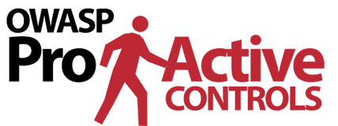

{ align=right width=140 }

Los [Top 10 Controles Proactivos][proactive10] de OWASP describen los controles y categorías de control más importantes
que los arquitectos de seguridad y los equipos de desarrollo deberían considerar en proyectos de aplicaciones web.

#### ¿Qué son los Top 10 Controles Proactivos?

Los Top 10 Controles Proactivos de OWASP es una lista de técnicas de seguridad que
deberían considerarse para aplicaciones web.
Están ordenados por orden de importancia, siendo el control número 1 el más importante:

* C1: [Implementar Control de Acceso][control1], ref [Hojas de Referencia][csproactive-c1]
* C2: [Usar Criptografía de la manera correcta][control2], ref [Hojas de Referencia][csproactive-c2]
* C3: [Validar todas las Entradas y Manejar Excepciones][control3], ref [Hojas de Referencia][csproactive-c3]
* C4: [Encargarse de la Seguridad desde el Inicio][control4], ref [Hojas de Referencia][csproactive-c4]
* C5: [Configuraciones Seguras por Defecto][control5], ref [Hojas de Referencia][csproactive-c5]
* C6: [Mantener sus Componentes Seguros][control6], ref [Hojas de Referencia][csproactive-c6]
* C7: [Implementar Identidad Digital][control7], ref [Hojas de Referencia][csproactive-c7]
* C8: [Aprovechar las Características de Seguridad del Navegador][control8], ref [Hojas de Referencia][csproactive-c8]
* C9: [Implementar Registro y Monitoreo de Seguridad][control9], ref [Hojas de Referencia][csproactive-c9]
* C10: [Detener la Falsificación de Solicitudes del Lado del Servidor][control10], ref [Hojas de Referencia][csproactive-c10]

#### ¿Por qué usarlos?

Los Controles Proactivos son una lista bien establecida de controles de seguridad, publicada por primera vez en 2014
y revisada en 2018, por lo que considerar estos controles puede verse como una mejor práctica.
Seguir las mejores prácticas siempre es recomendable:
como mínimo, una organización debería evitar las vulnerabilidades evitables.

Implementar estos controles proactivos puede ayudar a remediar vulnerabilidades de seguridad comunes, por ejemplo:

* [Clickjacking][csclick]
* [Credential Stuffing][cscreds] (Relleno de credenciales)
* [Cross-site leaks][csxsleaks] (Fugas entre sitios)
* Ataques de [Denegación de Servicio][csdos] (DoS)
* Ataques [XSS basados en DOM][csdom] incluyendo [DOM Clobbering][csdomclub]
* [IDOR][csidor] (Referencia de Objeto Directa Insegura)
* [Inyección][csinjection] incluyendo [inyección de comandos del sistema operativo][csosinjection] y [XXE][csxxe]
* Ataques de [inyección][csldap] específicos de LDAP
* [Contaminación de prototipos][csproto]
* Ataques [SSRF][csssrf]
* [Inyección SQL][cssql] y el uso de [Parametrización de Consultas][csquery]
* [Redirecciones y reenvíos no validados][csredirect]
* Ataques [XSS][csxss] y [Evasión de Filtros XSS][csxssevade]

#### Cómo aplicarlos

La serie OWASP Spotlight proporciona una visión general de cómo utilizar este proyecto de documentación:
'Proyecto 8 - [Controles Proactivos][spotlight08]'.

Durante el desarrollo de una aplicación web, considere utilizar cada control de seguridad
descrito en las secciones de los Controles Proactivos que sean relevantes para la aplicación.

Las Hojas de Referencia de OWASP han sido indexadas específicamente para [cada Control Proactivo][csproactive],
que pueden utilizarse como información adicional sobre la implementación del control.

#### Referencias

* [Proyecto de Controles Proactivos][proactive10] de OWASP
* [Índice de Controles Proactivos][csproactive] de Hojas de Referencia de OWASP

----

Traducción de versión [original en inglés][en070101].

La Guía del Desarrollador de OWASP es un esfuerzo comunitario; si hay algo que necesita cambiarse,
[cree un issue][issue070101] o [edítelo en GitHub][edit070101].

[csclick]: https://cheatsheetseries.owasp.org/cheatsheets/Clickjacking_Defense_Cheat_Sheet
[cscreds]: https://cheatsheetseries.owasp.org/cheatsheets/Credential_Stuffing_Prevention_Cheat_Sheet
[csdom]: https://cheatsheetseries.owasp.org/cheatsheets/DOM_based_XSS_Prevention_Cheat_Sheet
[csdomclub]: https://cheatsheetseries.owasp.org/cheatsheets/DOM_Clobbering_Prevention_Cheat_Sheet
[csdos]: https://cheatsheetseries.owasp.org/cheatsheets/Denial_of_Service_Cheat_Sheet
[csidor]: https://cheatsheetseries.owasp.org/cheatsheets/Insecure_Direct_Object_Reference_Prevention_Cheat_Sheet
[csinjection]: https://cheatsheetseries.owasp.org/cheatsheets/Injection_Prevention_Cheat_Sheet
[csosinjection]: https://cheatsheetseries.owasp.org/cheatsheets/OS_Command_Injection_Defense_Cheat_Sheet
[csldap]: https://cheatsheetseries.owasp.org/cheatsheets/LDAP_Injection_Prevention_Cheat_Sheet
[csproto]: https://cheatsheetseries.owasp.org/cheatsheets/Prototype_Pollution_Prevention_Cheat_Sheet
[csproactive]: https://cheatsheetseries.owasp.org/IndexProactiveControls
[csproactive-c1]: https://cheatsheetseries.owasp.org/IndexProactiveControls.html#c1-define-security-requirements
[csproactive-c2]: https://cheatsheetseries.owasp.org/IndexProactiveControls.html#c2-leverage-security-frameworks-and-libraries
[csproactive-c3]: https://cheatsheetseries.owasp.org/IndexProactiveControls.html#c3-secure-database-access
[csproactive-c4]: https://cheatsheetseries.owasp.org/IndexProactiveControls.html#c4-encode-and-escape-data
[csproactive-c5]: https://cheatsheetseries.owasp.org/IndexProactiveControls.html#c5-validate-all-inputs
[csproactive-c6]: https://cheatsheetseries.owasp.org/IndexProactiveControls.html#c6-implement-digital-identity
[csproactive-c7]: https://cheatsheetseries.owasp.org/IndexProactiveControls.html#c7-enforce-access-controls
[csproactive-c8]: https://cheatsheetseries.owasp.org/IndexProactiveControls.html#c8-protect-data-everywhere
[csproactive-c9]: https://cheatsheetseries.owasp.org/IndexProactiveControls.html#c9-implement-security-logging-and-monitoring
[csproactive-c10]: https://cheatsheetseries.owasp.org/IndexProactiveControls.html#c10-handle-all-errors-and-exceptions
[csredirect]: https://cheatsheetseries.owasp.org/cheatsheets/Unvalidated_Redirects_and_Forwards_Cheat_Sheet
[cssql]: https://cheatsheetseries.owasp.org/cheatsheets/SQL_Injection_Prevention_Cheat_Sheet
[csquery]: https://cheatsheetseries.owasp.org/cheatsheets/Query_Parameterization_Cheat_Sheet
[csssrf]:  https://cheatsheetseries.owasp.org/cheatsheets/Server_Side_Request_Forgery_Prevention_Cheat_Sheet
[csxss]: https://cheatsheetseries.owasp.org/cheatsheets/Cross_Site_Scripting_Prevention_Cheat_Sheet
[csxsleaks]: https://cheatsheetseries.owasp.org/cheatsheets/XS_Leaks_Cheat_Sheet
[csxssevade]: https://cheatsheetseries.owasp.org/cheatsheets/XSS_Filter_Evasion_Cheat_Sheet
[csxxe]: https://cheatsheetseries.owasp.org/cheatsheets/XML_External_Entity_Prevention_Cheat_Sheet
[control1]: https://top10proactive.owasp.org/the-top-10/c1-accesscontrol/
[control2]: https://top10proactive.owasp.org/the-top-10/c2-crypto/
[control3]: https://top10proactive.owasp.org/the-top-10/c3-validate-input-and-handle-exceptions/
[control4]: https://top10proactive.owasp.org/the-top-10/c4-secure-architecture/
[control5]: https://top10proactive.owasp.org/the-top-10/c5-secure-by-default/
[control6]: https://top10proactive.owasp.org/the-top-10/c6-use-secure-dependencies/
[control7]: https://top10proactive.owasp.org/the-top-10/c7-secure-digital-identities/
[control8]: https://top10proactive.owasp.org/the-top-10/c8-help-the-browser-defend-the-user/
[control9]: https://top10proactive.owasp.org/the-top-10/c9-security-logging-and-monitoring/
[control10]: https://top10proactive.owasp.org/the-top-10/c10-stop-server-side-request-forgery/
[edit070101]: https://github.com/OWASP/DevGuide/blob/main/docs/es/05-implementation/01-documentation/01-proactive-controls.md
[en070101]: https://devguide.owasp.org/en/05-implementation/01-documentation/01-proactive-controls/
[issue070101]: https://github.com/OWASP/DevGuide/issues/new?labels=content&template=request.md&title=Update:%2005-implementation/01-documentation/01-proactive-controls
[proactive10]: https://top10proactive.owasp.org/
[spotlight08]: https://youtu.be/HRtYDCWOSc0
