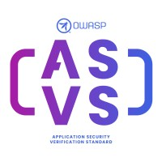

{ align=right width=180 }

El [Estándar de Verificación de Seguridad de Aplicaciones][asvs] (ASVS)
es un proyecto insignia de OWASP establecido desde hace tiempo,
y es ampliamente utilizado como guía durante la verificación de aplicaciones web.

Se puede descargar desde la [página del proyecto OWASP][asvs] en varios idiomas y formatos:
PDF, Word, CSV, XML y JSON. Dicho esto, la forma recomendada de consumir el ASVS es acceder
directamente a las [páginas markdown en GitHub][asvsmd] - esto asegurará que se use la versión más reciente.

#### ¿Qué es ASVS?

El ASVS es un estándar abierto que establece la cobertura y el "nivel de rigor" esperado cuando se trata de
realizar la verificación de seguridad de aplicaciones web.
El estándar también proporciona una base para el testeo de cualquier control técnico de seguridad
que se utilice para proteger contra vulnerabilidades en la aplicación.

El ASVS se divide en varias secciones:

* V1 [Arquitectura, Diseño y Modelado de Amenazas][asvsV1]
* V2 [Autenticación][asvsV2]
* V3 [Gestión de Sesiones][asvsV3]
* V4 [Control de Acceso][asvsV4]
* V5 [Validación, Sanitización y Codificación][asvsV5]
* V6 [Criptografía Almacenada][asvsV6]
* V7 [Manejo de Errores y Registro de actividad][asvsV7]
* V8 [Protección de Datos][asvsV8]
* V9 [Comunicación][asvsV9]
* V10 [Código Malicioso][asvsV10]
* V11 [Lógica de Negocio][asvsV11]
* V12 [Archivos y Recursos][asvsV12]
* V13 [API y Servicios Web][asvsV13]
* V14 [Configuración][asvsV14]

El ASVS define tres [niveles de verificación de seguridad][asvsL123]:

1. aplicaciones que solo necesitan niveles bajos de garantía;
  estas aplicaciones son completamente comprobables mediante pruebas de penetración
2. aplicaciones que contienen datos sensibles que requieren protección;
  el nivel recomendado para la mayoría de las aplicaciones
3. las aplicaciones más críticas que requieren el más alto nivel de confianza

La mayoría de las aplicaciones apuntarán al Nivel 2,
con solo aquellas aplicaciones que realizan transacciones de alto valor,
o contienen datos médicos sensibles, aspirando al más alto nivel de confianza de nivel 3.

#### ¿Por qué usarlo?

El ASVS es utilizado por muchas organizaciones como base para la verificación de sus aplicaciones web.
Está bien establecido, las primeras versiones fueron escritas en 2008, y ha tenido continuo mantenimiento desde entonces.

El ASVS es exhaustivo, por ejemplo, la versión 4.0.3 tiene una lista de 286 requisitos de verificación,
y estos requisitos de verificación han sido creados y acordados por una amplia comunidad de seguridad.
Usar el ASVS como guía proporciona una base sólida para el proceso de verificación.

#### Cómo utilizarlo

La serie OWASP Spotlight proporciona una descripción general del ASVS y sus usos:
'Proyecto 19 - [Estándar OWASP de Verificación de Seguridad de Aplicaciones (ASVS)][spotlight19]'.

El ASVS debe usarse como guía para el proceso de verificación, eligiendo el nivel apropiado de verificación entre:

* Nivel 1: Primeros pasos, automatizado, o vista de todo el portafolio
* Nivel 2: La mayoría de las aplicaciones
* Nivel 3: Alto valor, alta garantía o alta seguridad

Use el ASVS como orientación en lugar de intentar implementar todos los controles posibles.
Herramientas como [SecurityRAT][srat] pueden ayudar a crear un subconjunto más manejable de los requisitos del ASVS.

La guía ASVS ayudará a los desarrolladores a construir controles de seguridad
que satisfarán los requisitos de seguridad de la aplicación.

Las Hojas de Referencia de OWASP han sido indexadas específicamente para [cada sección del ASVS][csasvs],
que pueden usarse como documentación para ayudar a decidir si una categoría de requisitos debe incluirse en la verificación.

#### Referencias

* [Estándar OWASP de Verificación de Seguridad de Aplicaciones][asvs] (ASVS)
* [Índice ASVS][csasvs] de OWASP
* Proyecto [SecurityRAT][srat] de OWASP

----

Traducción de versión [original en inglés][en080103].

La Guía para Desarrolladores de OWASP es un esfuerzo comunitario; si hay algo que necesita cambiarse
entonces [cree un issue][issue080103] o [edítelo en GitHub][edit080103].

[asvs]: https://owasp.org/www-project-application-security-verification-standard/
[asvsL123]: https://github.com/OWASP/ASVS/blob/v4.0.3/4.0/en/0x03-Using-ASVS.md#application-security-verification-levels
[asvsmd]: https://github.com/OWASP/ASVS/blob/v4.0.3/4.0/en/0x00-Header.md
[asvsV1]: https://github.com/OWASP/ASVS/blob/v4.0.3/4.0/en/0x10-V1-Architecture.md#v1-architecture-design-and-threat-modeling
[asvsV2]: https://github.com/OWASP/ASVS/blob/v4.0.3/4.0/en/0x11-V2-Authentication.md#v2-authentication
[asvsV3]: https://github.com/OWASP/ASVS/blob/v4.0.3/4.0/en/0x12-V3-Session-management.md#v3-session-management
[asvsV4]: https://github.com/OWASP/ASVS/blob/v4.0.3/4.0/en/0x12-V4-Access-Control.md#v4-access-control
[asvsV5]: https://github.com/OWASP/ASVS/blob/v4.0.3/4.0/en/0x13-V5-Validation-Sanitization-Encoding.md#v5-validation-sanitization-and-encoding
[asvsV6]: https://github.com/OWASP/ASVS/blob/v4.0.3/4.0/en/0x14-V6-Cryptography.md#v6-stored-cryptography
[asvsV7]: https://github.com/OWASP/ASVS/blob/v4.0.3/4.0/en/0x15-V7-Error-Logging.md#v7-error-handling-and-logging
[asvsV8]: https://github.com/OWASP/ASVS/blob/v4.0.3/4.0/en/0x16-V8-Data-Protection.md#v8-data-protection
[asvsV9]: https://github.com/OWASP/ASVS/blob/v4.0.3/4.0/en/0x17-V9-Communications.md#control-objective
[asvsV10]: https://github.com/OWASP/ASVS/blob/v4.0.3/4.0/en/0x18-V10-Malicious.md#v10-malicious-code
[asvsV11]: https://github.com/OWASP/ASVS/blob/v4.0.3/4.0/en/0x19-V11-BusLogic.md#v11-business-logic
[asvsV12]: https://github.com/OWASP/ASVS/blob/v4.0.3/4.0/en/0x20-V12-Files-Resources.md#v12-files-and-resources
[asvsV13]: https://github.com/OWASP/ASVS/blob/v4.0.3/4.0/en/0x21-V13-API.md#v13-api-and-web-service
[asvsV14]: https://github.com/OWASP/ASVS/blob/v4.0.3/4.0/en/0x22-V14-Config.md#v14-configuration
[csasvs]: https://cheatsheetseries.owasp.org/IndexASVS.html
[edit080103]: https://github.com/OWASP/DevGuide/issues/new?labels=content&template=request.md&title=Update:%2006-verification/01-guides/05-asvs.md
[en080103]: https://devguide.owasp.org/en/06-verification/01-guides/05-asvs/
[issue080103]: https://github.com/OWASP/DevGuide/issues/new?labels=enhancement&template=request.md&title=Update:%2006-verification/01-guides/03-asvs
[spotlight19]: https://youtu.be/3puIavsZfAk
[srat]: https://owasp.org/www-project-securityrat/
